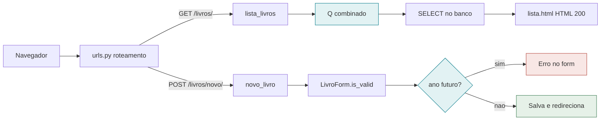

# Biblioteca — Trabalho Django (Aulas 4 e 5)

Projeto Django que consolida as atividades práticas da **Aula 4** (models,
migrações, ORM e Admin) e da **Aula 5** (views, URLs, templates e forms),
com os requisitos adicionais do trabalho: tipo de acervo, categoria e
pesquisa.

**[Ver o diagrama e a explicação das features da P1 (site)](https://rasgf.github.io/Marcio_trab1_Django/)**

O sistema em si (a Biblioteca rodando de verdade) precisa de um servidor
Python de verdade, o GitHub Pages não roda Django. Instruções de deploy
no Render logo abaixo, na seção "Colocando o site no ar".

## Requisitos do trabalho

Ver [`docs/enunciado.txt`](docs/enunciado.txt). Resumo do que foi
implementado:

- [x] Model `Livro` com **tipo de acervo** (Digital ou Físico)
- [x] Model `Livro` com **categoria** (classes 000 a 900, conforme a
      Classificação Decimal indicada no enunciado)
- [x] Pesquisa por **nome** (título/autor), **tipo** e **categoria** na
      página `/livros/`
- [x] Histórico do repositório com o passo a passo das aulas 4 e 5, em
      commits separados

## Estrutura

- **Projeto**: `biblioteca/`
- **App**: `acervo/`
  - `models.py` — model `Livro`
  - `admin.py` — cadastro no Django Admin
  - `forms.py` — `LivroForm` (ModelForm)
  - `views.py` — `lista_livros` (listagem + busca) e `novo_livro`
    (cadastro)
  - `urls.py` — rotas do app
  - `templates/acervo/` — `base.html`, `lista.html`, `form.html`
  - `static/acervo/estilo.css`
  - `fixtures/livros.json` — 10 livros de exemplo

## Como rodar

```bash
# 1. ambiente virtual
python3 -m venv venv
source venv/bin/activate        # Windows: venv\Scripts\activate

# 2. dependências
pip install -r requirements.txt

# 3. variáveis de ambiente
cp .env.example .env
# edite o .env se quiser usar PostgreSQL (ver comentários no arquivo);
# por padrão o projeto já roda com SQLite, sem configuração extra.

# 4. banco de dados
python manage.py migrate

# 5. (opcional) carregar livros de exemplo
python manage.py loaddata livros

# 6. usuário administrador
python manage.py createsuperuser

# 7. rodar
python manage.py runserver
```

Acesse:

- `http://127.0.0.1:8000/livros/` — lista e busca de livros
- `http://127.0.0.1:8000/livros/novo/` — cadastrar um livro
- `http://127.0.0.1:8000/admin/` — Django Admin

## Colocando o site no ar (Render)

O repositório já vem pronto pra isso (`render.yaml`, `gunicorn`,
`whitenoise` pros arquivos estáticos). Falta só conectar sua conta:

1. Crie uma conta gratuita em [render.com](https://render.com) (dá pra
   entrar direto com login do GitHub, não pede cartão).
2. No painel, clique em **New +** e depois em **Blueprint**.
3. Escolha o repositório `Marcio_trab1_Django` (autorize o Render a ler
   seus repositórios se ele pedir).
4. O Render lê o `render.yaml` sozinho e mostra o serviço `biblioteca`
   configurado. Ele vai pedir o valor de `ADMIN_PASSWORD` (deixei como
   secreto de propósito, então não fica salvo no repositório): escolha
   uma senha ali.
5. Clique em **Apply**. O primeiro build demora alguns minutos: instala
   as dependências, roda as migrações, carrega os 10 livros de exemplo e
   cria o usuário admin.
6. No final o Render mostra uma URL parecida com
   `https://biblioteca-xxxx.onrender.com`. É essa URL que vai pro
   professor.

No plano gratuito, se ninguém acessar por um tempo o serviço entra em
modo de espera, e a próxima pessoa que abrir o link espera uns 30 a 50
segundos ele voltar. É assim mesmo no plano free, não é erro.

Login do admin depois do deploy: usuário `admin`, senha é a que você
escolheu no passo 4.

## Pesquisa

A página de listagem aceita os parâmetros de busca (combináveis) via
query string:

- `?q=` — busca por título ou autor
- `?tipo=digital` ou `?tipo=fisico`
- `?categoria=000` até `?categoria=900`

Exemplo: `/livros/?q=machado&categoria=800`

## Como as duas features da P1 funcionam

Essas duas features (busca combinada e validação customizada) fazem parte
da entrega da P1, além do CRUD das Aulas 4 a 6. Documentei aqui como cada
uma funciona por dentro, pra ficar registrado o motivo de cada escolha.

### O fluxo da requisição



Uma requisição só chega e o `urls.py` decide, pelo endereço e pelo método,
qual das duas rotas ela segue. Depois disso o caminho é bem diferente:
uma rota vai buscar no banco, a outra passa por uma validação antes de
decidir se salva ou devolve erro.

<details>
<summary><strong>Feature 1: como a busca funciona (clique pra expandir)</strong></summary>

```python
# acervo/views.py
filtro = Q()
if nome:
    filtro &= Q(titulo__icontains=nome) | Q(autor__icontains=nome)
if tipo:
    filtro &= Q(tipo_acervo=tipo)
if categoria:
    filtro &= Q(categoria=categoria)

livros = Livro.objects.filter(filtro)
```

Q() guarda uma condição lógica numa variável, em vez de aplicá-la na hora.
Isso é necessário aqui porque a busca por texto precisa de OU (título OU
autor), e a forma simples de filtrar do Django (filter(campo=valor)) só
sabe fazer E. O `&=` vai encaixando cada novo critério preenchido com E na
condição toda; se um filtro não foi preenchido, ele simplesmente não
entra na consulta.

</details>

<details>
<summary><strong>Feature 2: como a validação funciona (clique pra expandir)</strong></summary>

```python
# acervo/forms.py
def clean_ano(self):
    ano = self.cleaned_data.get('ano')
    ano_atual = timezone.now().year
    if ano and ano > ano_atual:
        raise forms.ValidationError(
            f'O ano de publicação não pode ser posterior a {ano_atual}.'
        )
    return ano
```

`self.cleaned_data.get('ano')` é um dicionário com os valores já
convertidos pro tipo certo (aqui, ano já é um int, não uma string vinda do
input). `timezone.now().year` é só o ano atual de verdade.

`raise forms.ValidationError(...)` é igual a lançar uma exceção em
qualquer linguagem: interrompe o fluxo normal e carrega uma mensagem. O
Django captura essa exceção automaticamente, marca o campo ano como
inválido e guarda a mensagem, que `{{ form.as_p }}` (no template) já sabe
exibir do lado do campo, sem nenhum código extra nosso.

</details>

### Por que escolhi esses campos e essa regra

Na Feature 1 busco por título e autor porque é isso que uma pessoa lembra
quando quer achar um livro, ninguém decora o número do registro dentro do
sistema. O filtro por categoria faz sentido porque o acervo já é dividido
em dez classes fixas, diferente de um campo booleano tipo disponível, que
só tem dois valores possíveis. Sem esse filtro combinado o usuário teria
que rolar a lista inteira toda vez que quisesse achar algo específico, o
que não funciona bem num acervo com centenas de livros cadastrados.

Na Feature 2 a regra escolhida foi que o ano de publicação não pode ser
maior que o ano atual. O motivo é simples: o Django sozinho só garante que
aquele campo é um número inteiro preenchido, ele não sabe o que esse
número significa dentro do nosso problema. Sem essa validação daria pra
cadastrar um livro com ano 3000 sem nenhum aviso, o que não faz sentido
porque um livro só entra no acervo depois de já ter sido publicado. Essa é
justamente uma regra que o Django não tem como adivinhar sozinho, porque
depende de conhecer o domínio do problema, e não só o tipo do dado.

## Aulas de referência

- **Aula 4 — Django na Prática I**: venv, projeto, app, model, migrações,
  ORM, Django Admin, PostgreSQL e `python-dotenv`.
- **Aula 5 — Django na Prática II**: views, URLs, templates, herança de
  templates, arquivos estáticos e forms (`ModelForm`).
